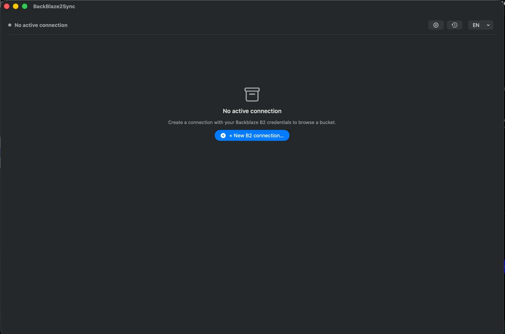
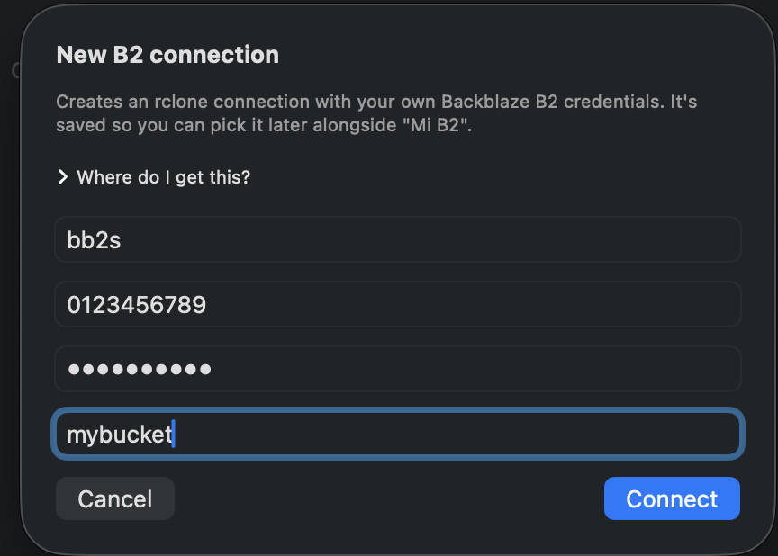
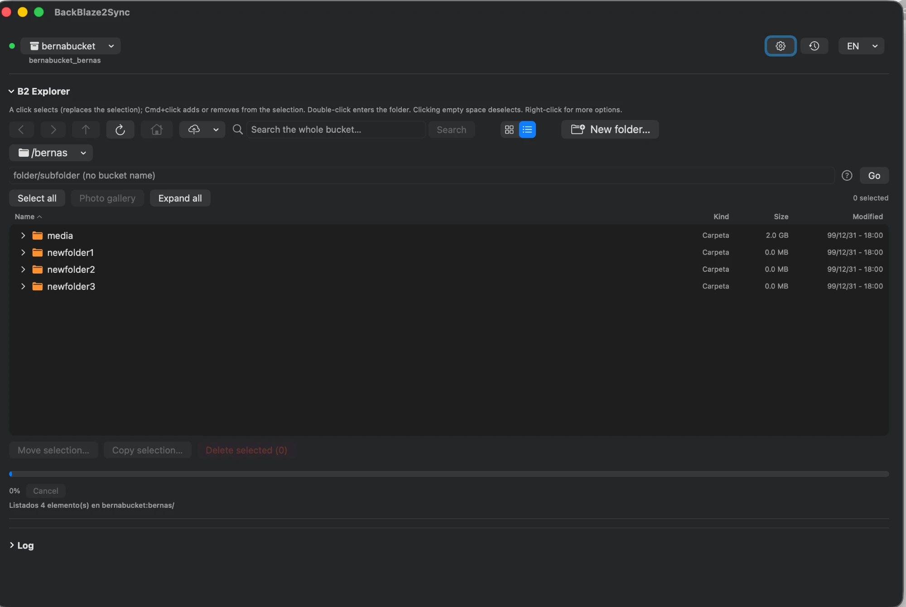
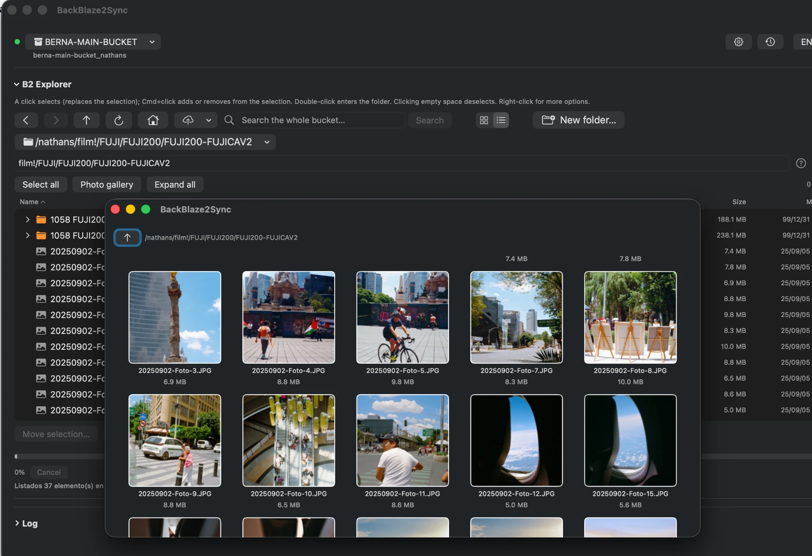
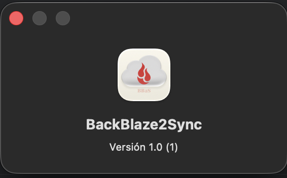

# BackBlaze2Sync

Native macOS app (SwiftUI) to use Backblaze B2 with a graphic interface. 

## Yeah, I'm aware  Cyberduck and Transmit already exists

Cyberduck is great and everything, it already provides access to many services but in a generic way. I wanted BackBlaze2Sync to focus solely on Backblaze B2 to offer things that a generic client doesn't have:

- Operation history with per-file details such as name, size, success or failure, folder movements sorted by days and hours.
- Fuzzy search by folder or across the entire bucket root.
- Integrated photo gallery with thumbnail view and full-screen viewer.
- Compress a remote folder to .zip without requiring manual download.
- Automatic integrity verification after uploading a file.
- Download links that force "Save file" instead of opening directly in the browser. (Option to customize expiration days)
- General usage statistics (In development).


## Main features

- B2 Finder-style explorer: icon view and list view with expandable tree.
- Upload, download, move, copy, and delete files and folders, with confirmation before destructive actions.
- Drag and drop from Finder into the app or within the same explorer.
- Multiple B2 connections (multiple accounts or buckets).
- Generate shareable links for files with expiration date.

## Requirements

- macOS 14 or later.
- Xcode.
- [rclone](https://rclone.org/) installed via Homebrew: `brew install rclone`. The app detects it automatically (Apple Silicon, Intel, or via PATH); if not found, it shows the exact command to install it when launched.
- [XcodeGen](https://github.com/yonaskolb/XcodeGen) to generate the Xcode project.

## How to build

The `-destination "generic/platform=macOS"` is required so the build is universal
(Apple Silicon + Intel) — without it, `xcodebuild` compiles only for the architecture
of the Mac where you run the command.

```bash
xcodegen generate
xcodebuild -project BackBlaze2Sync.xcodeproj -scheme BackBlaze2Sync -configuration Release \
  -destination "generic/platform=macOS" build
```

## Screenshots

| | |
|---|---|
|  |  |
|  |  |
|  | |
